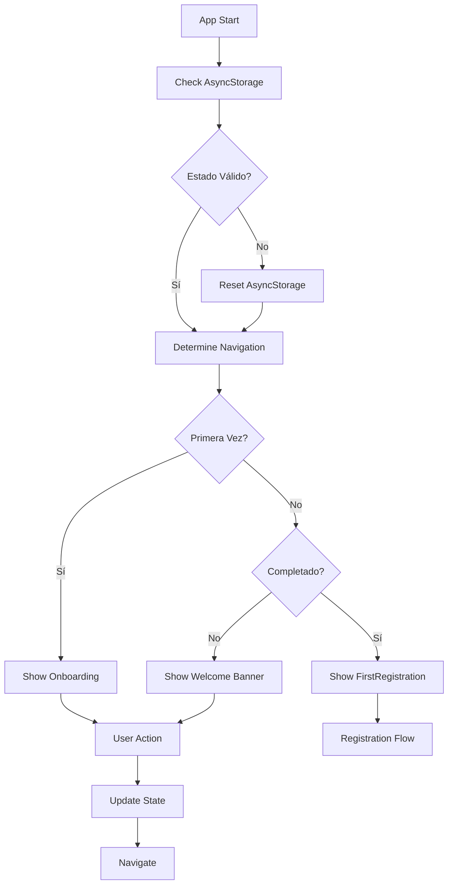

# Design Document - Navigation & UX Testing

## Overview

Este documento describe el diseño de la solución para corregir los problemas críticos de navegación y UX identificados en la aplicación AutoConnect. Los problemas incluyen navegación incorrecta, botones no funcionales, warnings de deprecación y estados inconsistentes de AsyncStorage.

## Architecture

### Problema Identificado

Basándose en los logs proporcionados, se identificaron los siguientes problemas críticos:

1. **Estado AsyncStorage Conflictivo**: El usuario tiene tanto `onboarding_completed: 'true'` como `onboarding_skipped: 'true'`
2. **Navegación Incorrecta**: Se renderiza FirstRegistration pero muestra pantalla de bienvenida en lugar del registro
3. **Botón No Funcional**: "Registrar mi primer vehículo" no responde
4. **Warnings de Deprecación**: shadow* y pointerEvents deprecated
5. **Múltiples Cargas**: useFirstRegistration se ejecuta múltiples veces

### Arquitectura de Solución



## Components and Interfaces

### 1. AsyncStorage State Manager

```typescript
interface OnboardingState {
  hasCompleted: boolean;
  hasSkipped: boolean;
  isFirstTime: boolean;
  lastUpdated: string;
}

class AsyncStorageManager {
  static async getOnboardingState(): Promise<OnboardingState>
  static async setOnboardingCompleted(): Promise<void>
  static async setOnboardingSkipped(): Promise<void>
  static async resetOnboardingState(): Promise<void>
  static async validateState(): Promise<boolean>
}
```

### 2. Navigation State Manager

```typescript
interface NavigationState {
  currentScreen: 'onboarding' | 'welcome' | 'firstRegistration' | 'dashboard';
  previousScreen?: string;
  canGoBack: boolean;
  navigationHistory: string[];
}

class NavigationManager {
  static determineInitialScreen(onboardingState: OnboardingState): string
  static validateTransition(from: string, to: string): boolean
  static logNavigation(from: string, to: string): void
}
```

### 3. Button Action Handler

```typescript
interface ButtonAction {
  id: string;
  handler: () => void;
  isEnabled: boolean;
  loadingState?: boolean;
}

class ButtonActionManager {
  static registerAction(action: ButtonAction): void
  static executeAction(actionId: string): Promise<void>
  static validateAction(actionId: string): boolean
}
```

## Data Models

### AsyncStorage Schema Corregido

```typescript
// Esquema limpio y consistente
interface StorageSchema {
  // Onboarding state - solo uno debe ser true
  onboarding_state: 'not_started' | 'completed' | 'skipped';
  onboarding_timestamp: string;
  
  // User preferences
  user_preferences: {
    theme: 'light' | 'dark';
    notifications: boolean;
  };
  
  // Vehicle data
  vehicles: Vehicle[];
  maintenance_history: MaintenanceHistory;
}
```

### Navigation State Model

```typescript
interface AppNavigationState {
  // Current state
  currentScreen: ScreenType;
  showOnboarding: boolean;
  showFirstRegistration: boolean;
  showWelcomeBanner: boolean;
  
  // Navigation history
  navigationStack: ScreenType[];
  canGoBack: boolean;
  
  // Loading states
  isLoading: boolean;
  isTransitioning: boolean;
}
```

## Error Handling

### 1. AsyncStorage Error Recovery

```typescript
class AsyncStorageErrorHandler {
  static async handleCorruptedData(key: string): Promise<void> {
    console.warn(`🔧 Corrupted data detected for key: ${key}`);
    await AsyncStorage.removeItem(key);
    // Reset to default state
  }
  
  static async handleStorageFailure(): Promise<void> {
    console.error('❌ AsyncStorage completely failed, using memory storage');
    // Fallback to in-memory storage
  }
}
```

### 2. Navigation Error Recovery

```typescript
class NavigationErrorHandler {
  static handleInvalidTransition(from: string, to: string): void {
    console.error(`❌ Invalid navigation: ${from} -> ${to}`);
    // Reset to known good state
  }
  
  static handleRenderError(component: string, error: Error): void {
    console.error(`❌ Render error in ${component}:`, error);
    // Show error boundary
  }
}
```

## Testing Strategy

### 1. Unit Tests

```typescript
describe('AsyncStorageManager', () => {
  test('should handle conflicting states correctly', async () => {
    // Setup conflicting state
    await AsyncStorage.setItem('onboarding_completed', 'true');
    await AsyncStorage.setItem('onboarding_skipped', 'true');
    
    // Should resolve to completed state
    const state = await AsyncStorageManager.getOnboardingState();
    expect(state.hasCompleted).toBe(true);
    expect(state.hasSkipped).toBe(false);
  });
});
```

### 2. Integration Tests

```typescript
describe('Navigation Flow', () => {
  test('should navigate correctly from onboarding to registration', async () => {
    // Start with clean state
    await AsyncStorageManager.resetOnboardingState();
    
    // Complete onboarding
    const { result } = renderHook(() => useWelcomeBanner());
    act(() => {
      result.current.completeOnboarding();
    });
    
    // Should show FirstRegistration
    expect(result.current.showFirstRegistration).toBe(true);
  });
});
```

### 3. E2E Tests

```typescript
describe('User Journey', () => {
  test('complete onboarding to vehicle registration flow', async () => {
    // 1. Start app
    const app = render(<App />);
    
    // 2. Should show onboarding
    expect(app.getByText('Bienvenido a AutoConnect')).toBeVisible();
    
    // 3. Navigate through slides
    const nextButton = app.getByText('Siguiente');
    fireEvent.press(nextButton);
    fireEvent.press(nextButton);
    fireEvent.press(nextButton);
    
    // 4. Complete onboarding
    const completeButton = app.getByText('Comenzar ahora');
    fireEvent.press(completeButton);
    
    // 5. Should show FirstRegistration
    expect(app.getByText('AutoTrack')).toBeVisible();
    
    // 6. Press register button
    const registerButton = app.getByText('Registrar mi primer vehículo');
    fireEvent.press(registerButton);
    
    // 7. Should show registration form
    expect(app.getByText('¿Cuál es la marca?')).toBeVisible();
  });
});
```

## Implementation Plan

### Phase 1: Critical Fixes (Immediate)

1. **Fix AsyncStorage State Conflicts**
   - Implement state validation and cleanup
   - Add migration logic for existing users
   - Add comprehensive logging

2. **Fix Button Actions**
   - Debug and fix "Registrar mi primer vehículo" button
   - Add visual feedback for all button presses
   - Implement proper event handlers

3. **Fix Deprecation Warnings**
   - Replace shadow* with boxShadow
   - Fix pointerEvents usage
   - Update all deprecated style properties

### Phase 2: Navigation Improvements (Week 1)

1. **Implement Robust Navigation State**
   - Single source of truth for navigation
   - Proper state transitions
   - Navigation history tracking

2. **Add Error Boundaries**
   - Graceful error handling
   - Recovery mechanisms
   - User-friendly error messages

3. **Performance Optimizations**
   - Reduce unnecessary re-renders
   - Optimize AsyncStorage operations
   - Add loading states

### Phase 3: Testing & Validation (Week 2)

1. **Comprehensive Test Suite**
   - Unit tests for all navigation logic
   - Integration tests for user flows
   - E2E tests for critical paths

2. **Manual Testing Protocol**
   - Detailed test cases
   - Cross-platform validation
   - Performance benchmarks

3. **Monitoring & Analytics**
   - Error tracking
   - Navigation analytics
   - Performance metrics

## Specific Fixes for Current Issues

### 1. AsyncStorage Conflict Resolution

```typescript
// Current problem: Both states are true
// onboarding_completed: 'true'
// onboarding_skipped: 'true'

// Solution: Implement state priority and cleanup
const resolveConflictingStates = async () => {
  const completed = await AsyncStorage.getItem('onboarding_completed');
  const skipped = await AsyncStorage.getItem('onboarding_skipped');
  
  if (completed === 'true' && skipped === 'true') {
    console.log('🔧 Resolving conflicting onboarding states');
    // Priority: completed > skipped
    await AsyncStorage.removeItem('onboarding_skipped');
    return 'completed';
  }
  
  return completed === 'true' ? 'completed' : 
         skipped === 'true' ? 'skipped' : 'not_started';
};
```

### 2. Button Action Fix

```typescript
// Current problem: Button doesn't respond
// Solution: Add proper event handling and debugging

const handleRegisterVehicle = () => {
  console.log('🚗 Register vehicle button pressed');
  
  // Add visual feedback
  setIsLoading(true);
  
  // Execute navigation
  setCurrentScreen('register');
  
  // Log success
  console.log('✅ Navigation to register screen completed');
  
  setIsLoading(false);
};
```

### 3. Style Warnings Fix

```typescript
// Current problem: shadow* deprecated warnings
// Solution: Use boxShadow for web compatibility

const styles = StyleSheet.create({
  card: {
    // ❌ Old way - causes warnings
    // shadowColor: '#000',
    // shadowOffset: { width: 0, height: 2 },
    // shadowOpacity: 0.1,
    // shadowRadius: 4,
    
    // ✅ New way - web compatible
    ...Platform.select({
      web: {
        boxShadow: '0 2px 4px rgba(0,0,0,0.1)',
      },
      default: {
        shadowColor: '#000',
        shadowOffset: { width: 0, height: 2 },
        shadowOpacity: 0.1,
        shadowRadius: 4,
        elevation: 2,
      },
    }),
  },
});
```

## Success Metrics

### Technical Metrics
- Zero deprecation warnings
- Navigation response time < 100ms
- AsyncStorage operations < 500ms
- Zero navigation-related crashes

### User Experience Metrics
- 100% button functionality
- Consistent navigation behavior
- Clear visual feedback
- Smooth transitions

### Quality Metrics
- 90%+ test coverage for navigation code
- All critical user flows tested
- Cross-platform compatibility verified
- Performance benchmarks met